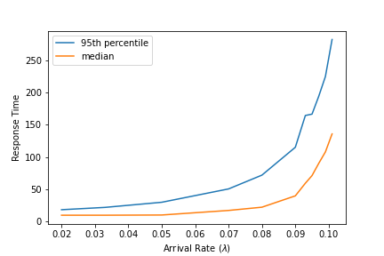
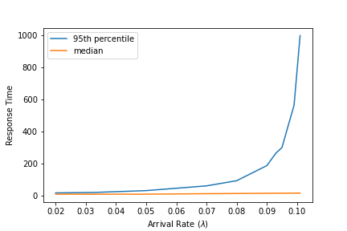

 Scheduling Lab

## 1 Scheduling Simulator Implementation

**(a) SRTF**

0: Arrival of Task 12 (ready queue length = 1)  
0: Run Task 12 for duration 2 (ready queue length = 0)  
1: Arrival of Task 13 (ready queue length = 1)  
2: Arrival of Task 14 (ready queue length = 2)  
2: IO wait for Task 12 for duration 1  
2: Run Task 14 for duration 1 (ready queue length = 1)  
3: Arrival of Task 15 (ready queue length = 2)  
3: Wakeup of Task 12 (ready queue length = 3)  
3: IO wait for Task 14 for duration 2  
3: Run Task 12 for duration 2 (ready queue length = 2)  
5: Wakeup of Task 14 (ready queue length = 3)  
5: Run Task 14 for duration 1 (ready queue length = 2)  
6: Run Task 15 for duration 2 (ready queue length = 1)  
8: Run Task 15 for duration 1 (ready queue length = 1)  
9: Run Task 13 for duration 2 (ready queue length = 0)  
11: Run Task 13 for duration 2 (ready queue length = 0)  
13: Run Task 13 for duration 2 (ready queue length = 0)  
15: Run Task 13 for duration 1 (ready queue length = 0)  
16: Stop  


**(b) MLFQ**

0: Arrival of Task 12 (ready queue length = 1)  
0: Run Task 12 for duration 2 (ready queue length = 0)  
1: Arrival of Task 13 (ready queue length = 1)  
2: Arrival of Task 14 (ready queue length = 2)  
2: IO wait for Task 12 for duration 1  
2: Run Task 13 for duration 2 (ready queue length = 1)  
3: Arrival of Task 15 (ready queue length = 2)  
3: Wakeup of Task 12 (ready queue length = 3)  
4: Run Task 14 for duration 1 (ready queue length = 3)  
5: IO wait for Task 14 for duration 2  
5: Run Task 15 for duration 2 (ready queue length = 2)  
7: Wakeup of Task 14 (ready queue length = 3)  
7: Run Task 12 for duration 2 (ready queue length = 3)  
9: Run Task 14 for duration 1 (ready queue length = 2)  
10: Run Task 13 for duration 4 (ready queue length = 1)  
14: Run Task 15 for duration 1 (ready queue length = 1)  
15: Run Task 13 for duration 1 (ready queue length = 0)  
16: Stop  

## 2 Approaching 100% Utilization

(a) This is an open system, since new tasks may arrive before old task completed

(b) We should choose $\frac{1}{M}$. Since the mean of exponential distribution is $\frac{1}{\lambda}$, then  
$$\frac{1}{\lambda} = M$$,  
so  
$$\lambda = \frac{1}{M}$$  

(c) We should choose $\frac{1}{2M}$. Same as (b), we have  
$$\frac{1}{\lambda} = 2M$$,  
so  
$$\lambda = \frac{1}{2M}$$  

(d) When $\lambda$ changes from small value to $\frac{1}{M}$, the CPU utilization increases linearly with steep slope and CPU utilization is about $50\%$ when arrival rate is $\frac{1}{2M}$, and $96\%$ when arrival rate is $\frac{1}{M}$, after $\lambda$ exceeds $\frac{1}{M}$ the CPU utilization increases more slowly and gradually approaches $100\%$  


(e) 

1. For median response time, it stays stable before arrival rate exceeds $\frac{1}{2M}$. After that response time increase gradually faster, when cpu utilization approaches $90\%$, response time grows drastically.
2. For 95th percentile response time, the growth trend is same as median response time. And for the same arrival rate, it is about 2 ~ 3 times as long as median response time.



(f)

1. When using SRTFQueue(LIFO), the median response time maintains at a low level (almost doesn't change), while the 95th percentile response time is much higher than using FCFSQueue. Using LIFO, when having multiple threads, scheduler always chooses the most recent thread, which reduces the median response time, while worsening starvation and 95th percentile response time. In other words, LIFO strategy is more friendly towards short jobs.



2. When using TLFBQueue, for the same arrival rate both the median response time and the 95th percentile time is higher than FCFSQueue.


(g) A system with nearly 100% throughput means tasks are arriving at a high rate and few context switching, which will increase average response time and cause latency.

## 3 Fairness for CPU Bursts

(a) For each task there will be only one thread running it at a time. So at any time, there will be at most 2 threads in FCFS queue.

(b) 50%. Because $S_{1}$ and $T_{1}$ have the same distribution, so $Pr[S_{1} < T_{1}] = Pr[S_{1} > T_{1}]$, $Pr[S_{1} < T_{1}] + Pr[S_{1} > T_{1}] = 1$. Thus $Pr[S_{1} < T_{1}] = 0.5$

(c) When m is large, $\frac{CPUTime(S) - mE[S_{i}]}{\sqrt{mVar(S_{i})}}$ according to standard Gaussian distribution. So $CPUTime(S) \sim N(mE[S_{i}], mVar(S_{i}))$

(d) Because $S_{i}$ and $T_{i}$ are independent of each other, $CPUTime(S_{i})$ is independent of $CPUTime(T_{i})$.  
So  
$nCPUTime(S_{i})-CPUTime(T_{i}) \sim N((n-1)mE[S_{i}], (n^2+1)mVar(S_{i}))$ where $E[S_{i}] = E[T_{i}]$ and $Var(S_{i}) = Var(T_{i})$
Therefore  
$$Pr[nCPUTime(S) < CPUTime(T)] = \Phi(\frac{-(n-1)mE[S_{i}]}{\sqrt{(n^2+1)mVar(S_{i})}})$$

(e) when m=100, the probability equals to 50.12%
when m=10000, the probability approximates to 0% 

```matlab
function res = calcP(m, n)
  x = (1-n) * m / sqrt(m*(n*n + 1))
  res = 2 * normcdf(x, 0, 1);
end
>> calcP(100, 1.1)
0.5012
>> calaP(10000, 1.1)
1.7352e-11
```

When m is big enough, then the CPU allocation will be fair with FCFS.

(f) 
We create two tasks for each simulation with different m, each task has m bursts represents m threads. When creating task, we precalculate m burst length for each task which subject to exponential distribution. In simulation, every time one thread finish, the corresponding task will return next cpu burst length as next running thread.  
For drawing the graph, we use different value of m, and plot the m vs. unfair fraction curve.  


As can be seen in the graph, the unfair fraction drastically decreasing with m increasing.  

```python
def create_problem3_task(lmbda, num_bursts):
    lengths = np.random.exponential(1 / lmbda, num_bursts)
    i = -1
    def cpu_burst(run_time):
        nonlocal i
        i += 1
        if i < len(lengths):
           return lengths[i]
        return 0
    return Task(0, np.sum(lengths), cpu_burst, nowait)
```
